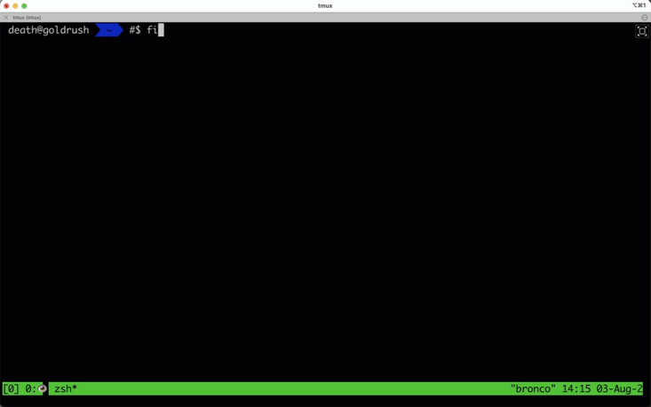

# Muxnet

Muxnet is a powerful tool that integrates tmux session monitoring with Ophanim AI capabilities. It allows users to interact with an AI assistant directly within their tmux sessions, providing a seamless blend of terminal multiplexing and artificial intelligence.



## Features

- Monitor active tmux sessions
- Integrate directly with Ophanim AI for prompt processing
- Support for multiple glyph-based commands
- Daemon and interactive modes
- Session labeling for easy identification
- Command filtering for safe execution
- Chat history management

## Supported Glyphs

Muxnet recognizes the following glyphs at the beginning of a line in tmux:

- `#$`: Regular prompt
- `#@`: RAG (Retrieval-Augmented Generation) prompt
- `#%`: Screen context prompt (includes filtered screen content)
- `#!`: Delete session file

## Requirements

- Go 1.16 or later
- tmux
- Access to an Ophanim AI server

## Installation

1. Clone the repository:
   ```
   git clone https://github.com/shell-company/muxnet-go.git
   cd muxnet
   ```

2. Install the required dependencies:
   ```
   go get github.com/Jeffail/gabs/v2
   go get github.com/gdamore/tcell/v2
   go get github.com/google/uuid
   go get github.com/gorilla/websocket
   go get github.com/rivo/tview
   ```

3. Build the application:
   ```
   go build muxnet.go
   ```

## Usage

Run Muxnet with the following command:

```
./muxnet [options]
```

### Options

- `-session NAME`: Specify a custom session name (default: generated MD5 hash)
- `-delay SECONDS`: Set the response delay in seconds (default: 2)
- `-d`: Run in daemon mode

### Examples

1. Start Muxnet in interactive mode:
   ```
   ./muxnet -session my_project
   ```

2. Run Muxnet as a daemon with a 5-second delay:
   ```
   ./muxnet -d -delay 5
   ```

## Environment Variables

Muxnet uses the following environment variables for configuration:

- `OPHANIM_HOST`: Ophanim server hostname (default: ophanim.azai.run)
- `OPHANIM_PORT`: Ophanim server port (default: 443)
- `OPHANIM_PROTO`: Ophanim server protocol (default: wss)
- `OPHANIM_SAVE_DIR`: Directory for saving chat history (default: ~/.config/ophanim/)

## How It Works

1. Muxnet continuously scans for active tmux sessions.
2. When it detects a line starting with a recognized glyph, it processes the prompt.
3. Prompt is enriched to increase the likelihood of a successful commandline completion.
4. The prompt is sent to the Ophanim AI server for processing.
5. Muxnet filters the response and sends it back to the tmux session.

## Additional Notes

To use Muxnet, you need access to an Ophanim AI server. A default server is provided, but you can also set up your own server by following the instructions in [REDACTED]. General inference requests are served by `MosaicML/mpt-7b-8k` while RAG requests are served by `HuggingFaceH4/zephyr-7b-beta`. These models have been found maliable to adversarial attacks, which conciquently can be used to adapt them to our needs.

## Disclaimer 

Muxnet is a proof-of-concept tool (provided as-is) and should be used for educational purposes only. The developers are not responsible for any misuse of this tool, damage caused by it, or any legal consequences that may arise from its use. Postive results are not guaranteed, and the quality of responses may vary.